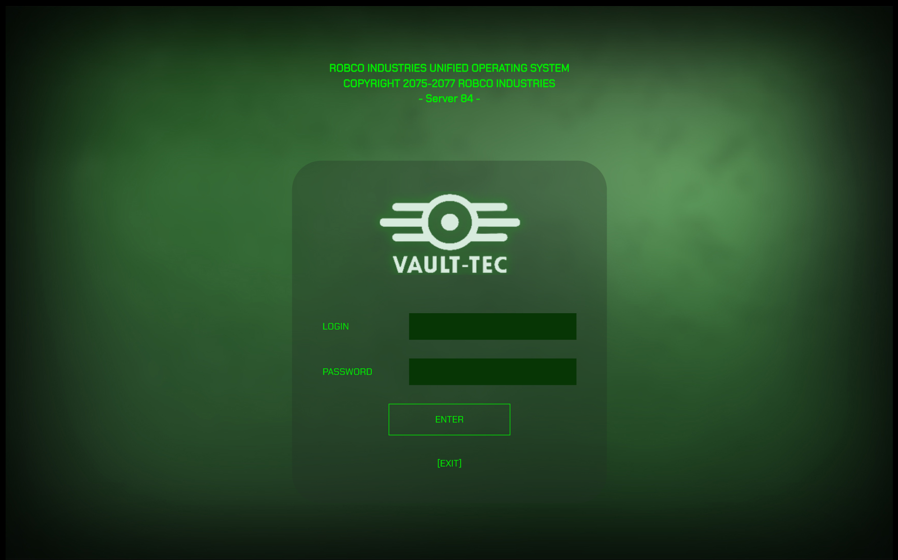

# Fallout RPG Terminal: Game Master Tool

A retro-inspired terminal application for tabletop RPG sessions in the Fallout universe.
This tool is designed for **Game Masters (GMs)** to manage Vaults and Overseer log entries, while also serving as an *
*immersive handout for players** who can interact with the Vault terminal, attempt to hack it, and uncover the
Overseer’s logs.
<p align="center"> </p>

---

## 📖 Description

This project was built as a dual-purpose tool for Fallout RPG sessions:

- **For Game Masters**: a management system to create, update, and delete Vaults and their associated Overseer log
  entries.
- **For Players**: an immersive, retro-style Vault terminal handout where they can log in, hack the system, and read
  curated Overseer logs prepared by the GM.

The application replicates the feel of Fallout’s in-game terminals, enhancing immersion and interaction during RPG
sessions.
It was fully designed and implemented by me from scratch as a portfolio project.

---

## Features

- Retro-inspired UI in the style of Fallout terminals.
- GM-only access (login: `Game Master`, password: `Fallout`).
- Vault management system: add, edit, update, or delete Vaults.
- Overseer log system: prepare narrative entries for each Vault.
- Player mode: players can attempt to **hack the Vault terminal** or access it using overseer's credentials and browse
  available logs.
- Supports multiple Vaults with switching capability.

### Hacking mode

Players can attempt hacking using ``hacker`` as login and the number of successes from the hacking test (during the RPG
session).
If the number is equal or grater to the vault's security level, the access is granted.


---

## Tech Stack

- **Python 3.11+**
- **Flet** – for the UI
- **SQLAlchemy** – ORM for database handling
- **SQLite** – local database
- Additional Python libraries: see [`requirements.txt`](./requirements.txt)

---

## Installation

Clone the repository and install dependencies:

```bash
git clone https://github.com/YOUR_USERNAME/fallout-vault-terminal.git
cd fallout-vault-terminal
pip install -r requirements.txt
```

Run the application:

```bash
python main.py
```

---

## Usage

- **Game Master Login**
    - Username: `Game Master`
    - Password: `Fallout`
      Unlocks Vault and log management features.

- **Player Interaction**
    - Players can log in as a Vault user or attempt to hack the Overseer’s terminal.
    - Hacking currently works with a numeric difficulty check system.
